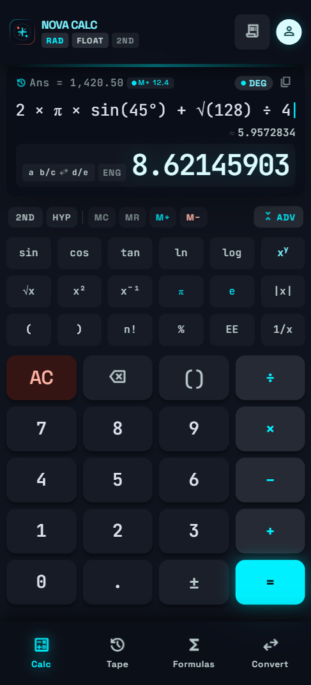
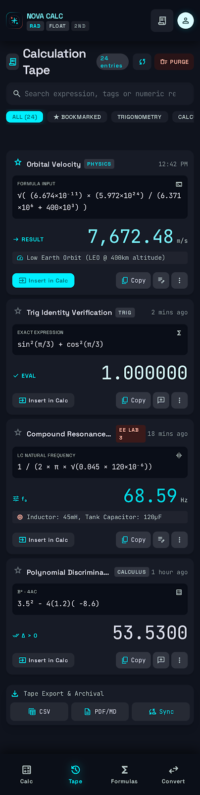
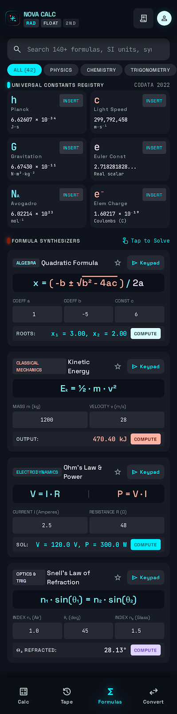
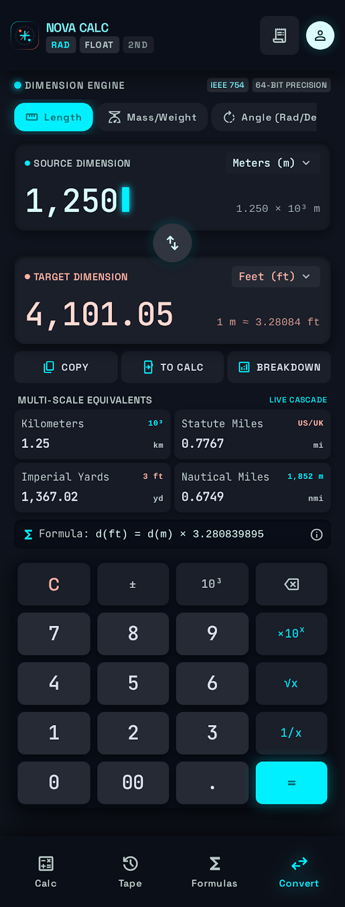

<p align="center">
  
</p>

<h1 align="center">Nova Calc</h1>

<p align="center">
  <strong>A premium scientific calculator built with Flutter</strong>
</p>

<p align="center">
  <a href="#features">Features</a> •
  <a href="#screenshots">Screenshots</a> •
  <a href="#installation">Installation</a> •
  <a href="#architecture">Architecture</a> •
  <a href="#contributing">Contributing</a> •
  <a href="#license">License</a>
</p>

<p align="center">
  
  
  
  
</p>

---

## About

**Nova Calc** is a feature-rich scientific calculator app inspired by the precision aesthetics of Braun industrial design and modern glassmorphism. It goes beyond basic arithmetic — offering a full scientific function deck, calculation history tape, 140+ physics/math/chemistry formulas with live computation, and a multi-scale unit converter.

Built entirely with Flutter, it runs on **Android, iOS, Web, Windows, macOS, and Linux**.

---

## Screenshots

<p align="center">
  
  &nbsp;&nbsp;
  
  &nbsp;&nbsp;
  
  &nbsp;&nbsp;
  
</p>

---

## Features

### 🧮 Scientific Calculator
- Full numeric keypad with arithmetic operators (`+`, `−`, `×`, `÷`)
- Scientific functions: `sin`, `cos`, `tan`, `ln`, `log`, `√`, `x²`, `^`
- **DEG / RAD** angle mode toggle
- **2nd** and **HYP** modifier modes
- **Live preview** — see results as you type
- Fraction display toggle (`a b/c ↔ d/e`)
- Clipboard copy support
- Memory registers: `MC`, `MR`, `M+`, `M-`
- Previous answer (`Ans`) recall
- Haptic feedback on key press

### 📜 Calculation Tape & History
- Timestamped history of all calculations
- Star / bookmark important entries
- Category tags (Physics, Trig, Calculus, etc.)
- Insert results back into calculator with one tap
- Copy expressions and results
- Export to CSV, PDF/MD, or Sync

### Σ Formulas & Constants (140+)
- **Universal Constants Registry** — Planck constant, speed of light, gravitational constant, Avogadro's number, Euler constant, elementary charge, and more (CODATA 2022)
- **Formula Synthesizers** — interactive formula cards you can solve in-app:
  - Quadratic Formula
  - Kinetic Energy
  - Ohm's Law & Power
  - Snell's Law of Refraction
  - ...and many more
- Insert constants directly into the calculator
- Search across formulas, SI units, and symbols
- Category filters: Physics, Chemistry, Trigonometry, Algebra

### ↔ Unit Converter
- **Dimension Engine** with IEEE 754 64-bit precision
- Categories: Length, Mass/Weight, Angle, Temperature, and more
- **Multi-scale equivalents** — see conversions across related units simultaneously
- Live cascade updates as you type
- Conversion formula display
- Built-in numeric keypad with scientific notation (`×10ˣ`), square root (`√x`), and reciprocal (`1/x`)
- Copy result or send directly to calculator

### 🎨 Design
- Obsidian dark theme with glassmorphism depth
- Electric cyan, warm coral, and auxiliary violet accent system
- JetBrains Mono + Space Grotesk typography
- Tactile neo-morphic button styling with pressed states
- Material 3 design tokens

---

## Installation

### Prerequisites

- [Flutter SDK](https://docs.flutter.dev/get-started/install) **3.13+**
- [Dart SDK](https://dart.dev/get-dart) **3.13+**
- Android Studio / Xcode (for mobile) or Chrome (for web)

### Clone & Run

```bash
# Clone the repository
git clone https://github.com/ANUJSHARMA0/nova-calc.git
cd nova-calc

# Install dependencies
flutter pub get

# Run on your connected device or emulator
flutter run
```

### Platform-Specific Builds

```bash
# Android
flutter build apk --release

# iOS
flutter build ios --release

# Web
flutter build web --release

# Windows
flutter build windows --release

# macOS
flutter build macos --release

# Linux
flutter build linux --release
```

---

## Architecture

```
lib/
├── main.dart                          # App entry point & MaterialApp config
├── models/
│   ├── constant_item.dart             # Data model for formula constants
│   └── tape_entry.dart                # Data model for history tape entries
├── screens/
│   ├── main_navigation_screen.dart    # Bottom nav bar & tab controller
│   ├── calculator_screen.dart         # Scientific calculator UI & keypad
│   ├── history_tape_screen.dart       # Calculation history / tape viewer
│   ├── formulas_constants_screen.dart # Formulas & universal constants
│   └── unit_converter_screen.dart     # Multi-scale unit converter
├── services/
│   ├── calculator_engine.dart         # Expression parser, evaluator & memory
│   └── unit_converter_service.dart    # Unit conversion logic & categories
└── theme/
    ├── app_colors.dart                # Obsidian glassmorphism color palette
    └── app_typography.dart            # JetBrains Mono & Space Grotesk styles
```

### Key Dependencies

| Package | Purpose |
|---------|---------|
| [`google_fonts`](https://pub.dev/packages/google_fonts) | JetBrains Mono & Space Grotesk typography |
| [`math_expressions`](https://pub.dev/packages/math_expressions) | Mathematical expression parsing |
| [`intl`](https://pub.dev/packages/intl) | Number formatting & internationalization |

---

## Contributing

Contributions are welcome! Please see [CONTRIBUTING.md](CONTRIBUTING.md) for guidelines.

1. Fork the repository
2. Create your feature branch (`git checkout -b feature/amazing-feature`)
3. Commit your changes (`git commit -m 'Add amazing feature'`)
4. Push to the branch (`git push origin feature/amazing-feature`)
5. Open a Pull Request

---

## License

This project is licensed under the MIT License — see the [LICENSE](LICENSE) file for details.

---

<p align="center">
  Made with ❤️ and Flutter
</p>
