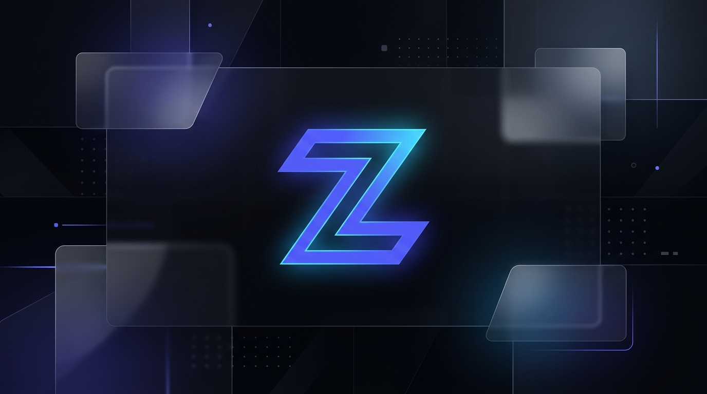

<div align="center">



# ⚡ Zenith

**An elite, tactile productivity workspace crafted with obsidian aesthetics**

[](https://react.dev)
[](https://www.typescriptlang.org)
[](https://vitejs.dev)
[](https://capacitorjs.com)
[](LICENSE)

[Features](#-features) · [Screenshots](#-screenshots) · [Quick Start](#-quick-start) · [Tech Stack](#-tech-stack) · [Architecture](#-architecture) · [Contributing](#-contributing) · [License](#-license)

</div>

---

## 🎯 About

**Zenith** is a premium task management and productivity app designed for ambitious individuals who demand both power and aesthetics from their tools. Built with a custom **Kinetic Obsidian** design system, it delivers an experience that feels like using a finely tuned instrument — every interaction is deliberate, every pixel is intentional.

> *"Calm velocity — frictionless capture, absolute clarity under cognitive load, and deliberate momentum without sensory fatigue."*

Zenith runs natively on the **web** and on **Android** (via Capacitor), with all data persisted locally for privacy-first, zero-latency operation.

---

## ✨ Features

### 📋 Task Management
- **Quick Add** — Lightning-fast task creation with keyboard shortcut support
- **Priority System** — Four-tier priority hierarchy (High / Medium / Low / None) with color-coded chips
- **Subtasks** — Break down complex tasks into manageable pieces
- **Due Dates & Times** — Full date and time scheduling
- **Recurring Tasks** — Daily, weekly, monthly, or weekday recurrence patterns
- **Star / Important** — Flag critical tasks for quick filtering

### 📁 Organization
- **Projects & Sections** — Group tasks into projects with collapsible sections
- **Tags** — Flexible, color-coded tagging system
- **Smart Views** — Today, Inbox, Upcoming, Important, Completed — auto-sorted and filtered
- **Board View** — Kanban-style board organized by priority
- **Calendar View** — Visual month calendar with task distribution

### 🎨 Design & UX
- **Kinetic Obsidian Design System** — Bespoke dark-mode aesthetic with glassmorphic elevation layers
- **Light & Dark Themes** — Full light mode support with system-auto detection
- **3 Density Modes** — Compact, Comfortable, or Spacious layouts
- **Custom Accent Colors** — Personalize the primary accent color
- **Confetti & Sound Effects** — Celebration animations on task completion (toggleable)
- **Command Palette** — `Ctrl+K` quick navigation and actions

### 📊 Insights
- **Statistics Dashboard** — Completion rates, streaks, priority breakdowns, and weekly activity charts
- **Progress Rings** — Visual completion indicators on projects and the today dashboard

### 🔔 Notifications & Reminders
- **Local Notifications** — Native Android notifications via Capacitor
- **Reminder Options** — At due time, 15 min before, 1 hour before, or 1 day before
- **Notification Center** — In-app notification feed

### 💾 Data
- **Local-First Storage** — All data persisted in `localStorage` — zero server dependency
- **Import / Export** — Full JSON data export and import for backups
- **Reset to Defaults** — One-click factory reset with seed data

---

## 📸 Screenshots

> **Note:** To add screenshots, place your images in the `docs/` folder and uncomment the lines below.

<!--
<div align="center">
  
  &nbsp;&nbsp;
  
</div>

<div align="center">
  
  &nbsp;&nbsp;
  
</div>
-->

---

## 🚀 Quick Start

### Prerequisites

- [Node.js](https://nodejs.org/) **v18+**
- [npm](https://www.npmjs.com/) (comes with Node)

### Installation

```bash
# Clone the repository
git clone https://github.com/ANUJSHARMA0/zenith.git
cd zenith

# Install dependencies
npm install

# Start the development server
npm run dev
```

Open **http://localhost:5173** and you're in 🚀

### Build for Production

```bash
npm run build
npm run preview    # Preview the production build locally
```

### Android (Capacitor)

```bash
# Build web assets & sync to Android
npm run cap:build

# Open in Android Studio
npx cap open android
```

---

## 🧰 Tech Stack

| Layer          | Technology                                                   |
| -------------- | ------------------------------------------------------------ |
| **Framework**  | [React 18](https://react.dev) with TypeScript                |
| **Bundler**    | [Vite 5](https://vitejs.dev) — blazing-fast HMR              |
| **State**      | [Zustand 5](https://zustand-demo.pmnd.rs/) — lightweight store |
| **Styling**    | CSS Modules + custom CSS design tokens                       |
| **Icons**      | [Lucide React](https://lucide.dev)                           |
| **Mobile**     | [Capacitor 6](https://capacitorjs.com) — native Android wrapper |
| **Fonts**      | [Geist](https://vercel.com/font) + [JetBrains Mono](https://www.jetbrains.com/lp/mono/) |
| **Effects**    | [canvas-confetti](https://www.kirilv.com/canvas-confetti/)   |
| **Utilities**  | [clsx](https://github.com/lukeed/clsx) — conditional classes |

---

## 🏗 Architecture

```
zenith/
├── public/                  # Static assets (favicon)
├── src/
│   ├── components/
│   │   ├── layout/          # AppShell, Sidebar, TopBar
│   │   ├── shared/          # CommandPalette, SettingsModal, NotificationCenter
│   │   ├── tasks/           # TaskItem, TaskDetailsPanel, QuickAddModal
│   │   └── ui/              # Design-system primitives (Button, Badge, Modal, etc.)
│   ├── pages/               # Top-level view screens
│   │   ├── TodayDashboard   # Daily focus view with progress ring
│   │   ├── InboxView        # Unassigned tasks
│   │   ├── UpcomingView     # Future-dated tasks
│   │   ├── ImportantView    # Starred tasks
│   │   ├── CompletedView    # Done archive
│   │   ├── ProjectView      # Project detail with sections
│   │   ├── CalendarView     # Month-based calendar grid
│   │   ├── BoardView        # Kanban priority board
│   │   └── StatsView        # Analytics dashboard
│   ├── stores/              # Zustand state management
│   │   ├── useTaskStore     # Task CRUD, filtering, sorting
│   │   ├── useProjectStore  # Projects, sections, navigation
│   │   ├── useTagStore      # Tag management
│   │   └── useSettingsStore # Theme, density, preferences
│   ├── services/            # Side-effect services
│   │   ├── storage          # localStorage persistence layer
│   │   ├── notifications    # Capacitor local notifications
│   │   └── seedData         # Default demo data
│   ├── types/               # Shared TypeScript interfaces
│   ├── utils/               # Pure helpers (date, id, confetti, audio)
│   └── styles/              # Global CSS & Kinetic Obsidian design tokens
├── android/                 # Capacitor Android project
├── capacitor.config.ts      # Capacitor configuration
├── vite.config.ts           # Vite configuration
├── tsconfig.json            # TypeScript configuration
└── package.json
```

---

## 🎨 Design System — Kinetic Obsidian

Zenith ships with a fully custom design system documented in [`kinetic_obsidian/DESIGN.md`](kinetic_obsidian/DESIGN.md). Key principles:

- **Obsidian Dark Foundation** — Ultra-deep zinc slate palette optimized for flow states
- **Glassmorphic Elevation** — Translucent backdrop blurs with hairline borders instead of harsh shadows
- **Electric Indigo Accent** (`#6366F1`) — Primary beacon for active states
- **Radiant Cyan** (`#38BDF8`) — Information streams and scheduled contexts
- **Rose Coral** (`#F43F5E`) — Critical triage and urgent states
- **4px Sub-Grid / 8px Macro Rhythm** — Mathematically precise spacing scale
- **Geist + JetBrains Mono** — Surgical precision typography with monospace for data

---

## ⌨️ Keyboard Shortcuts

| Shortcut              | Action                        |
| --------------------- | ----------------------------- |
| `Ctrl + K`            | Open Command Palette          |
| `N`                   | Quick Add Task                |
| `Esc`                 | Close modal / panel           |

---

## 🤝 Contributing

Contributions are welcome! Please read the [Contributing Guide](CONTRIBUTING.md) for details on the development workflow, coding standards, and pull request process.

---

## 📄 License

This project is licensed under the **MIT License** — see the [LICENSE](LICENSE) file for details.

---

<div align="center">

**Built with ❤️ and obsidian aesthetics**

⭐ Star this repo if you found it useful!

</div>
